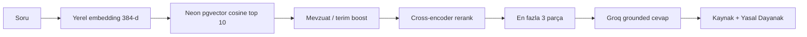

# FinÇevirmen RAG

FinÇevirmen bir sohbet botu değildir. Tüketici finansmanı dilini **kaynaklı**
sade Türkçeye çevirir. Model eğitilmez. Soru önce indekste aranır; dil modeli
yalnızca bulunan parçalara bakarak yazar.

Ürün kapsamı: terim sözlüğü, sözleşme jargonu, 6502 sayılı Kanun ve TCMB
2020/7 tebliği. Piyasa verisi, blog veya başka ürün külliyatı bu indekse
girmez.

## Mimari

Retrieve-then-rerank. Tek geçiş, sabit üst sınır.



| Aşama | Uygulama | Amaç |
|---|---|---|
| Gömme | `paraphrase-multilingual-MiniLM-L12-v2` | Soru ve parçalar aynı uzayda |
| Aday | pgvector `<=>`, ~10 | Hızlı hatırlama |
| Boost | Terim `ILIKE` + aidat/cayma/masraf mevzuat sorgusu | Madde kaçmasın |
| Rerank | `ms-marco-MiniLM-L-6-v2`, 10 → 3 | Gürültüyü kes |
| Üretim | Groq, düşük sıcaklık | Yalnızca bağlam |
| Kanıt | `regulation_source`, `regulation_reference` | Madde uydurma |

Kod: `rag/retrieval.py`, `rag/reranker.py`, `rag/llm_client.py`,
`rag/pipeline.py`. Web (`/api/ask`) ve MCP (`ask`) aynı pipeline’ı kullanır.

## Neden bu seçim

Külliyat küçüktür ve temizdir. Asıl risk yanlış madde numarasıdır, “ilişki
grafı kaçırmak” değildir.

| Aday mimari | Karar | Gerekçe |
|---|---|---|
| Retrieve-then-rerank | Kullanılıyor | Kontrol, gecikme, kaynak satırı |
| Hybrid BM25 + RRF | Şimdilik yok | Kelime tarafı boost ile karşılanıyor |
| GraphRAG | Yok | Soru tipi madde metni, varlık gezisi değil |
| Agentic RAG | Yok | Ekstra tur uydurma ve maliyet getirir |

Külliyat on binlerce sayfaya çıkarsa veya “Madde 31/3” tam eşleşmesi sık
kaçarsa hybrid arama eklenir. Çapraz madde atıfları ürün şartı olursa graf
ayrı değerlendirilir. İkisi de varsayılan değildir.

## Külliyat

| Kaynak | `source_type` | Not |
|---|---|---|
| Terim sözlüğü | `terim_sozlugu` | Kullanıcı terimleri ayrı yazılır |
| Sözleşme maddesi rehberi | `sozlesme_maddesi` | |
| Tüketici rehberi | `tuketici_rehberi` | |
| 6502 ve TCMB 2020/7 | `mevzuat` | Madde bazlı parçalama |

Mevzuat `data/knowledge_base/laws/` altından `scripts/ingest_laws.py` ile
alınır. Parçalama: `rag/law_chunking.py`.

Her parçada tutulur:

- `regulation_source`
- `regulation_reference`
- `last_updated_date`

Cevapta mevzuat varsa `📌 Yasal Dayanak` satırı yalnızca indeksteki kanun ve
madde numaralarını kullanır. 365 günden eski kayıtta sabit güncellik uyarısı
eklenir.

## Üretim kuralları

- Bağlamda yoksa “bağlamda yok” denir; tamamlanmaz.
- Faiz tavanı, vergi oranı, madde numarası uydurulmaz.
- Dilekçe şablondur (`rag/petitions.py`); hukuki tavsiye değildir.
- Oturumluk PDF’ler kalıcı indekse yazılmaz; oturum sonunda silinir.

## İşletme

```bash
./venv/bin/python scripts/init_db.py
./venv/bin/python scripts/ingest_data.py
./venv/bin/python scripts/ingest_laws.py
./venv/bin/python app.py
```

Ajan erişimi: [MCP.md](MCP.md)
